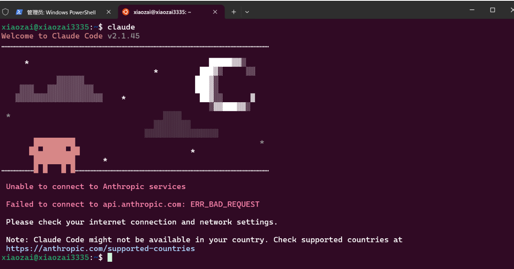

这份笔记综合了之前关于 **在 Windows 上通过 WSL (Linux 子系统) 安装 Claude Code** 的所有对话，特别针对**将系统安装在 E 盘**以节省 C 盘空间的需求，整理了一套完整的“最佳实践”流程。

您可以直接复制保存为 Markdown 文件（例如 `ClaudeCode_Setup.md`）。

***

# Windows 下部署 Claude Code 最佳实践指南 (WSL + E盘安装版)

## 📌 方案概述
本方案通过 Windows Subsystem for Linux (WSL) 运行 Claude Code，相比直接在 Windows 上运行，具有更好的兼容性和文件权限管理。
为了避免占用 C 盘空间，我们将 Ubuntu 系统文件“搬家”到 E 盘（或其他非系统盘）。

*   **目标环境**：Ubuntu 22.04 LTS
*   **安装位置**：E:\WSL\Ubuntu (可自定义)
*   **前置要求**：Windows 10 (版本 2004+) 或 Windows 11

---

## 第一阶段：启用 WSL 并获取基础镜像

**注意**：所有 `PS>` 开头的命令均需在 **PowerShell (管理员身份)** 中执行。

1.  **安装 WSL 框架与 Ubuntu**
    ```powershell
    # 这一步会启用 WSL 功能并下载 Ubuntu 22.04
    wsl --install -d Ubuntu-22.04
    ```

2.  **重启电脑**
    *   命令执行完毕后，**必须重启电脑**以完成内核安装。

3.  **初始化系统**
    *   重启后，会自动弹出一个黑色终端窗口（如果没有，搜索打开 `Ubuntu`）。
    *   等待安装初始化（Installing...）。
    *   按提示设置 **Username** (纯英文，如 `devuser`) 和 **Password** (输入时不可见)。
    *   看到绿色的 `username@hostname:~$` 提示符后，输入 `exit` 关闭窗口。

---

## 第二阶段：将 Linux 系统迁移至 E 盘 (核心步骤)

默认 WSL 安装在 C 盘，我们需要通过“打包-删除-解压”的方式将其迁移。

1.  **停止 WSL 服务**
    ```powershell
    wsl --shutdown
    ```

2.  **导出系统镜像 (备份)**
    *   将当前 C 盘的系统打包成一个 tar 文件放到 E 盘根目录。
    ```powershell
    # 耗时约 1-3 分钟
    wsl --export Ubuntu-22.04 E:\ubuntu_backup.tar
    ```

3.  **注销原系统 (释放 C 盘空间)**
    *   这一步会删除 C 盘的 Linux 文件。
    ```powershell
    wsl --unregister Ubuntu-22.04
    ```

4.  **在 E 盘重新导入系统**
    *   先创建存放文件夹：`E:\WSL\Ubuntu`
    ```powershell
    mkdir E:\WSL\Ubuntu
    # 导入命令：wsl --import <新名称> <安装路径> <备份包路径>
    wsl --import Ubuntu-22.04 E:\WSL\Ubuntu E:\ubuntu_backup.tar
    ```

5.  **恢复默认用户 (重要)**
    *   导入后的系统默认是以 root (管理员) 登录，不安全且配置麻烦。我们需要改回你在第一阶段设置的用户名。
    *   在 PowerShell 中运行：
    ```powershell
    # 请将 'devuser' 替换为你第一阶段设置的真实用户名
    wsl -d Ubuntu-22.04 -u root -e bash -c "echo -e '[user]\ndefault=devuser' >> /etc/wsl.conf"
    
    # 强制重启 WSL 使配置生效
    wsl --terminate Ubuntu-22.04
    ```

6.  **验证与清理**
    *   启动系统：`wsl -d Ubuntu-22.04` (确认现在是否为你的用户名)。
    *   删除备份包：在文件资源管理器中删除 `E:\ubuntu_backup.tar` 以节省空间。

---

## 第三阶段：配置环境与安装 Claude Code

现在你的 Linux 已经在 E 盘安家了。打开 Ubuntu 终端（或者在 PowerShell 输入 `wsl`），执行以下 **Linux 命令**。

1.  **安装 Node.js 环境 (使用 nvm 管理)**
    Claude Code 依赖 Node.js。
    ```bash
    # 1. 下载并安装 nvm (Node Version Manager)
    curl -o- https://raw.githubusercontent.com/nvm-sh/nvm/v0.39.7/install.sh | bash
    
    # 2. 让 nvm 立即生效 (或者关闭窗口重开)
    source ~/.bashrc
    
    # 3. 安装最新的 LTS (长期支持) 版本 Node.js
    nvm install --lts
    
    # 4. 验证安装
    node -v
    npm -v
    ```

2.  **安装 Claude Code**
    ```bash
    # 全局安装 Anthropic 的工具
    npm install -g @anthropic-ai/claude-code
    ```

3.  **启动与认证**
    ```bash
    # 启动命令
    claude
    ```
    *   首次运行会提示你进行认证。
    *   按回车键打开浏览器 -> 登录 Anthropic 账号 -> 授权 -> 完成。

## 错误信息 `Connection refused`

这是一个非常典型的网络问题。错误信息 `Connection refused` 告诉你：**你的 WSL 无法连接到 GitHub 的服务器**（`raw.githubusercontent.com` 在国内是被墙的）。

不用担心，我们只需要换一个**国内的镜像源**来安装即可。请依次执行以下步骤：

### 第一步：使用国内镜像安装 nvm

请复制下面这一整行命令（这是一个专门为国内用户优化的安装脚本，使用了 Gitee/快吉客 的镜像），在你的终端里粘贴并回车：

```bash
bash -c "$(curl -fsSL https://gitee.com/RubyMetric/nvm-cn/raw/main/install.sh)"
```

*   *解释：这个脚本会自动帮你从国内服务器下载 nvm，并且自动配置好速度最快的下载源。*

### 第二步：让配置立即生效

安装完成后，你需要让终端知道 nvm 已经装好了。输入下面这行命令：

```bash
source ~/.bashrc
```

### 第三步：验证安装

输入下面命令，如果显示出版本号（例如 `0.39.x`），说明 nvm 安装成功了：

```bash
nvm -v
```

---

### 第四步：安装 Node.js（关键一步）

虽然 nvm 装好了，但**下载 Node.js 本体时可能还会卡住**。为了防止卡住，请使用下面这条**带有国内镜像加速**的命令来安装 Node.js：

```bash
# 临时指定淘宝镜像源来下载 Node.js LTS 版本
NVM_NODEJS_ORG_MIRROR=https://npmmirror.com/mirrors/node nvm install --lts
```

### 第五步：安装 Claude Code

Node.js 装好后，最后安装 Claude Code。同样，为了防止下载慢，我们先设置 npm 的国内镜像，再安装：

1.  **设置 npm 国内镜像（永久加速）：**
    ```bash
    npm config set registry https://registry.npmmirror.com
    ```

2.  **安装 Claude Code：**
    ```bash
    npm install -g @anthropic-ai/claude-code
    ```

3.  **启动：**
    ```bash
    claude
    ```

**总结一下，你刚才遇到的问题只是因为那堵“墙”，换成国内的搬运工（镜像）就解决了！试试看吧。**

---

## 📝 以后考虑的笔记 (FAQ & 维护)

### 1. 这个系统占用了多少空间？
*   **初始占用**：约 1.5GB - 2GB。
*   **增长机制**：它是一个虚拟磁盘文件 (`ext4.vhdx`)，位于 `E:\WSL\Ubuntu` 下。你安装的软件越多，它会自动变大。
*   **上限**：默认最大支持 256GB（或者是你 E 盘的剩余空间），按需自增。

### 2. 如何彻底删除它？
如果你想卸载 Claude Code 或整个 Linux 系统，请执行以下步骤实现**彻底、干净**的删除：

1.  **注销系统 (逻辑删除)**：
    在 PowerShell 中执行：
    ```powershell
    wsl --unregister Ubuntu-22.04
    ```
2.  **物理删除**：
    手动删除 E 盘的文件夹 `E:\WSL\Ubuntu`。
3.  **应用卸载**：
    在 Windows 设置 -> 应用中，搜索 "Ubuntu"，如果有残留的应用图标，点击卸载。

### 3. 常用的 Claude Code 指令
进入 WSL 终端后：
*   `claude` : 启动交互式界面。
*   `/bug` : 报告错误。
*   `/clear` : 清除上下文记忆（省 Token）。
*   `Ctrl + C` : 强制终止当前生成的代码。

### 4. 访问 Windows 文件
在 Ubuntu 内部，你的 Windows 硬盘挂载在 `/mnt/` 下：
*   访问 C 盘：`cd /mnt/c`
*   访问 E 盘：`cd /mnt/e`
*   *建议*：尽量把代码放在 Ubuntu 的自己的目录下（例如 `~/project`），文件读写速度比在 `/mnt/` 下快得多。


### 5. 为什么显示 `/mnt/c`？

*   **这是“当前位置”，不是“安装位置”：**
    Linux 启动时，默认会自动进入你在 Windows 里的用户目录（也就是 `C:\Users\17820`）。
*   **WSL 的挂载机制：**
    在 Linux 里，Windows 的硬盘是被“挂载”进来的。
    *   `/mnt/c` = Windows 的 **C 盘**
    *   `/mnt/e` = Windows 的 **E 盘**
    *   `/` (根目录) = **Linux 系统本身** (这才是你安装在 E 盘的那个大文件)

你看到的提示符 `...:/mnt/c/Users/17820$` 只是告诉你：“我现在正在操作 Windows C 盘里的文件”，并不代表 Linux 系统安装在 C 盘。

---

### 6. 如何验证真的迁移到了 E 盘？

请执行以下两个检查，确认你的搬家是否成功：

#### 检查一：去 E 盘看一眼 (最直观)

1.  打开 Windows 的**文件资源管理器**。
2.  进入你之前设置的路径：**`E:\WSL\Ubuntu`** (或者你设置的其他路径)。
3.  看有没有一个很大的文件叫 **`ext4.vhdx`**？
    *   如果有，而且大小有几百兆或几个 G，**恭喜你，你的 Linux 系统就在这里！** 以后你在 Linux 里装的所有软件（包括 Claude Code），都会写入到这个 E 盘的文件里。

#### 检查二：去 C 盘确认已删除

1.  去默认安装路径看看：`C:\Users\17820\AppData\Local\Packages\`。
2.  搜一下有没有 `CanonicalGroupLimited.Ubuntu...` 这样的文件夹。
3.  如果没有，或者里面是空的，说明 C 盘的空间已经释放干净了。

---

### 7. 如何回到“真正的 Linux 内部”？

为了让 Claude Code 运行更快，同时也为了让你感觉“我确实是在 Linux 里”，请在终端输入：

```bash
cd ~
```

*(注意：波浪号 `~` 代表 Linux 的“家”目录)*

回车后，你的提示符会变成：
`xiaozai@...:~$`  (蓝色波浪号)

这时候输入 `pwd` (查看当前路径)，它会显示：
`/home/xiaozai`

**这个 `/home/xiaozai` 目录，物理上就存储在你的 `E:\WSL\Ubuntu\ext4.vhdx` 文件里。**

### 8.无法连接到Anthropic服务



这是一个非常非常经典的问题！千万不要觉得自己操作错了，而是 **WSL 2 的机制导致的**。

简单来说：**你在 Windows 上开了“魔法”，默认情况下 WSL 2 是蹭不到的。**

### 核心原因解释（为什么开了没用？）
WSL 2 其实是运行在 Hyper-V 里的一个**完整的虚拟机**。
*   **Windows** 是宿主机（房东）。
*   **Ubuntu (WSL)** 是虚拟机（租客）。
*   你的“魔法”软件运行在 Windows 上，它接管了 Windows 的网卡。
*   但是，**WSL 有自己独立的虚拟网卡**。默认情况下，WSL 的流量是直接穿过 Windows 出去的，**它没有走你的“魔法”通道**。

---

### ✅ 解决方法（让 WSL 走 Windows 的代理）

你需要做两件事：
1.  **在 Windows 的魔法软件里设置“允许局域网连接”**。
2.  **在 WSL 里输入命令，告诉它代理服务器在哪里**。

#### 第一步：设置 Windows 端的魔法软件
1.  打开你的魔法软件（Clash, v2rayN 等）。
2.  找到 **“允许局域网连接” (Allow LAN)** 这个选项，把它**开启**。
3.  查看你的 **端口号**（通常 HTTP/HTTPS 端口是 `7890`，或者是 `10809` 等，取决于你的软件设置）。我们假设是 **7890**（如果是其他的请自行替换）。

#### 第二步：在 WSL (Ubuntu) 里执行代理命令
请在你的黑色终端窗口里，**依次复制并执行**下面的命令（注意替换端口号）：

1.  **获取 Windows 的 IP 地址并设置代理**（直接复制这整段代码）：
    ```bash
    # 自动获取宿主机 IP
    host_ip=$(cat /etc/resolv.conf |grep "nameserver" |cut -f 2 -d " ")
    
    # 设置代理 (假设你的端口是 7890，如果不是请修改下面的数字！)
    export https_proxy="http://${host_ip}:7890"
    export http_proxy="http://${host_ip}:7890"
    export all_proxy="socks5://${host_ip}:7890"
    
    # 打印出来看看对不对
    echo "Current Proxy: $https_proxy"
    ```

2.  **测试一下通不通**：
    输入下面命令，看看能不能连接 Google：
    ```bash
    curl -I https://www.google.com
    ```
    *   如果显示 `HTTP/1.1 200 OK` 或者 `301 Moved`，说明**通了！**
    *   如果还是卡住或报错，说明端口号填错了，或者防火墙挡住了。

#### 第三步：再次运行 Claude
现在网络通了，再次尝试运行：
```bash
claude
```
这次应该就能连接上 `api.anthropic.com` 了。

---

### 💡 进阶：如何永久生效？
上面的命令关掉窗口就失效了。如果你想每次打开终端自动连代理，请把配置写入文件：

1.  打开配置文件：
    ```bash
    nano ~/.bashrc
    ```
2.  滚动到最下面，粘贴这段代码（记得改端口 `7890` 为你实际的端口）：
    ```bash
    # 获取 Windows IP
    host_ip=$(cat /etc/resolv.conf |grep "nameserver" |cut -f 2 -d " ")
    # 设置代理
    export https_proxy="http://${host_ip}:7890"
    export http_proxy="http://${host_ip}:7890"
    export all_proxy="socks5://${host_ip}:7890"
    ```
3.  按 `Ctrl + O` 保存，回车，然后 `Ctrl + X` 退出。
4.  刷新配置：
    ```bash
    source ~/.bashrc
    ```

---

### 总结
你之前的 frustration (挫败感) 是因为 WSL 和 Windows 是两台机器。**你给 Windows 穿了“防弹衣”，但 WSL 还是“裸奔”的**。按照上面的步骤，把 WSL 拉进“防弹衣”里就好了！

### 9. 潜在影响

*   **Hyper-V**：WSL 2 依赖 Hyper-V 虚拟化。如果你还在使用非常老旧的安卓模拟器（如旧版雷电、MuMu），可能会有冲突。解决方法是更新模拟器到最新版（大多数现代模拟器已兼容 Hyper-V）。
*   **性能**：不运行时不占用资源。运行时占用少量内存。