#串口通信
   ##串行通信和并行通信

### 基本定义与**概念**

**并行通信（Parallel）**：多位数据位同时通过多根物理线传输。例如8位并行总线有8根数据线，每个时钟周期可以并行传输8位。早起并行接口例子：传统的打印机并口，微处理器与外设之间的并行数据总线（如8/16/32-bit 数据总线）。

**串行通信（Serial）**：数据位按序列在但跟或者少数几根线上依次传输。常见串行接口：UART/USART,SPI,I2C,USB,CAN,RS-485等。嵌入式系统中越来越多采用串行接口，因为布线更少，距离更易控制。

按照数据传输方向来区分：

##### **单工通信**：

单向；主机从机，区分发送器以及接收器；只可以发送器给接收器发送数据；

```
发送器----》接收器
```

##### **双工通信**：

- 双向->半双工：不能同时进行收发（数据线一根 比如I^2^C RS-485）;

```
发送器---		---接收器
         ----
接收器---      ---发送器
```

- 全双工： 可以同时进行收发（数据线两根串口 SPI RS-232）；

```
发送器 -----------》接收器
接收器 《---------- 发送器
```

**有关术语：**

##### 比特率（bit rate）

指的是 单位时间内传输的二进制数据的位数， 单位是 **bps（bit per second ，比特/秒）**，也可以用kbps，Mbps，Gbps 来表示，用来描述数据的实际传输速度。

比如比特率为 100Mbps，代表每秒可以传输100兆个二进制位。

更多关注的是**实际的数据传输效率**，一般用来描述网络、文件传输的速度，比如我们常说的宽带带宽 100Mbps、下载速度 5MB/s（这里的 MB/s 和 bps 需要换算，1Byte=8bit），都是比特率的实际应用。

##### **波特率（baud）**

指的是单位时间内传输的信号码元的数量，单位是Baud （波特），用来描述通信信道的信号传输能力，一个码元可以携带一个或多个二进制位的信息。

比如波特率为 100Baud，代表每秒可以传输 100 个信号码元。

更多关注的是**通信信道的物理传输能力**，一般用来描述串口、无线射频等底层通信链路的信号传输能力，比如串口通信中常用的 9600Baud、115200Baud，都是波特率的应用。

##### 比特率（bit rate）和**波特率（baud）**二者的关系

比特率和波特率的换算公式为：比特率波特率每个码元携带的比特数每个码元携带的比特数，和信号的调制方式有关：

- 在**二进制调制**的场景中（比如最简单的 0 和 1 分别对应一个信号状态），1 个码元只能携带 1 个比特的信息，此时比特率 = 波特率
- 在**多进制调制**的场景中（比如使用 4 种不同的信号状态），1 个码元可以携带 2 个比特的信息（*l**o**g*24=2），此时比特率 = 波特率 × 2
- 以此类推，如果是 N 进制的调制方式，每个码元携带的比特数为*l**o**g*2*N*，比特率 = 波特率 × *l**o**g*2*N*

举个例子：如果通信信道的波特率是 9600Baud，使用的是 16 进制调制，那么每个码元携带的比特数是*l**o**g*216=4，此时的比特率就是 9600 ×4 = 38400bps

- **吞吐（throughput）**：有效数据（payload）每秒传输量（通常低于原始比特率，因为有帧头，起止位，校验等开销）。
- **延迟（latency）**：从一端发送一个字节到另一端被接收并且可用的时间（含成帧，排队，传输时延）。

### 传输原理（“比特怎样被传输过去”）

#### 并行的传输原理

并行通信把一组比特（比如一个字节的8位）在同一时刻送入多跟线。发送端在时钟沿（或者未定保持期间）把每根线驱到相应电平，接收端在同一时刻读取所有线的电平，组合成字节。

优点时单位时间内“看似”传输更多位（并行一次可传N位）。但并行要求各线时序严格对齐（时钟或者握手），否则会发生**位间偏斜（skew）**导致错误。

#### 串行的传输原理

**1.异步通信（如UART）**

- 发送端在每个字符前发送**<u>起始位</u>**（start，通常是低电平），后跟**数据位**（LSB-first常见），可选的**奇偶校验位**，最后一个护着多个**停止位**（stop，高电位）。
- 接收端通过检测起始位进入采样状态，然后有按照**既定波特率**在更改比特中心采样得到数据位。异步通信不传输时钟信号（时钟有发送/接收双方预先约定或者自动校准），因此需要波特率精度在一定范围内（通常容许几%误差）。
- 常见应用：串口终端，调试打印，简易设备通信。

**2.同步串行（如SPI，I2C 的时钟线，并且很多高速串行协议）**

- 发送端输出时同时提供时钟信号（SCLK或 SCL）；接收端按照时钟沿同步采样。同步方法避免了异步那样的起止位与采样偏差问题，可实现更高效率与耕地开销（因为不需要起/止位）。
- 典型：SPI（有独立时钟），I^2^C（时钟/数据共享的双线协议），SPI的全双工/主从架构等。

物理层与电平约定

- 串行/并行都依赖物理电平标准：**TTL/CMOS (0/3.3V or 5V)**、**RS-232（±12V）**、**RS-485（差分）**。不同标准需要电平转换芯片（如MAX232用于TTL-RS232）.
- 差分信号（如RS-482，CAN，USB的某些层）抗干扰，适合长距离。

#### 性能比较（吞吐，延迟，距离，成本，能耗，可靠性）

**吞吐（理论 vs 实际）**

- **并行**：在理想条件下依次并行传输N位，相比同样单线串行的速率看起来高N倍。但实际受限于PCB距离，信号完整性，线间串扰与skew，随熟虑上升很难拓展。
- **串行**：现代串行链路（比如高速串行 SERDES，USB、PCle）通过高速串行+编码/多路复用+差分对达到非常高的链路速率。对嵌入式常见的UART/SPI/I^2^C，单线或少数线通过更高时钟就i能达到较高吞吐，且更易在PCB上布线。

**最大距离与可靠性**

- 并行：受 线长度 限制严重，短距离（板内、芯片间）较好；长时间会因时延差（skew）和 EMI崩溃。

  [^时延差（skew）]: **时钟 skew**：是最常见的类型，指的是同一个时钟信号，到达不同的电路模块、或者不同的寄存器的时间不一样，产生的时间差。这种情况如果过大，会破坏电路的同步逻辑，导致数据采样出错，是高速 PCB 设计里需要重点优化的问题。**信号 skew**：指的是一组并行传输的信号（比如 DDR 的地址、数据总线），原本应该同时到达接收端，但是因为走线长度、介质不一样，出现的到达时间差，会影响数据的正确接收。产生的原因：主要和传输路径的长度、走线的介质特性、器件的响应速度差异有关
  [^EMI（Electromagnetic Interference）电磁干扰]: 指的是电子设备工作时，产生的电磁辐射或者电磁噪声，对其他的电子设备、或者自身的其他部分造成的干扰，会影响设备的正常工作。

- 串行：差分串行（比如RS-485，CAN）适合长距离与噪声环境；同步串行在中短距离非常稳定。

**成本与布线复杂度**

- 并行：数据线多 → PCB 走线复杂、连线器更贵、引脚占用多。

- 串行：线少，引脚/连线成本低，设计更简单。

**功耗**

- 更多线意味着更多驱动器，理论上并行更耗能；但实际也取决于速率与驱动电平。串行可以在空闲时进入低功耗状态，且差分驱动在高速下更节能/稳定（相对）。

**延迟（latency）**

- 并行：一次传输多个位，对小消息非常低延迟（单周期即可），但总体上握手/总线争用会增加复杂度。
- 串行：每字节按序传输，单字节传输延迟与波特率成反比；但对于流式大数据，串行在高比特率下的带宽可以充分竞争。

#### 具体差异与实现细节

**时钟与同步**

- 并行通常与**统一系统时钟**同步（或者使用握手机制同步）。
- 异步串行不传时钟，需要两端波特率接近；接收端在起始位后按预定采样点取样（对波特率漂移敏感）
- 同步串行（SPI/I^2^C）有时钟线 或 时钟协商 （I^2^C 的时钟拉低机制，SPI主机驱动 SCLK）。

### UART

通用异步 （波特率-时间）收发器，**串行、异步**通信总线

**两线制**（两根数据线 RX TX）、可以实现全双工的发送和接收

**全双工**

#### UART帧格式：

空闲位是1 高电平

起始位1位发送0 低电平

数据位最好发8位 0/1   5-8位先发低位后发高位

校验位1位发送 0/1    奇偶校验位 可以有也可无

停止位1位发送1      1-1.5-2位高电平

   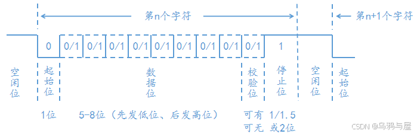

#### Q&A:

##### 1.为什么数据位从低位开始发，低位优先（LSB first）

硬件实现简单；

数据在接收端收到低位后，可以提起那进行累加、校验等基础运算，无需等待完整字节传输完毕；

而且发送的数据位不一定是8位，也有可能是其他位数

##### 2.UART 如何区别 0011、01、000111、00001111 等不同长度 / 数值的数据

因为没有同步时钟，根据波特率可能会有误差，一直积累误差可能出错；

利用**固定帧结构**以及起止位划分单帧边界

**空闲中断/超时判断**：利用UART的空闲状态或定会十七超市，判断一帧数据结束，简单来说就是发一个数据要等一下，避免积累误差。

### RS232、RS485 （UART电气层的处理 本质是UART）

#### 为解决串口UART的问题而生：

1. 电气接口不统一：
   UART只是对**信号的时序**进行了定义，<u>没有定义接口的电气特性，没有连接器的标准；</u>
   也就是时序上只是定义了高电平和低电平，但是高低电平是多少，在每个板子 不同环境有不同标准。

2. 抗干扰能力差：
   TTL信号抗干扰能力差，容易出错

   [^TTL]: 物联网设备的硬件通信需要统一的电平标准，TTL电平是常用的一种                                                                                                           **5V TTL 电平**高电平：2.0V ~ 5V，对应逻辑 1低电平：0V ~ 0.8V，对应逻辑 0                                                                                                              **3.3V TTL 电平（更常见，物联网设备多为低功耗设计）**高电平：2.0V ~ 3.3V，对应逻辑 1低电平：0V ~ 0.8V，对应逻辑 0

3. 通信距离短：
   一般只用用一个电路板上两个芯片通信

#### RS232协议：串行通讯标准化，还对信号电平加以规定

全双工 串行 异步：编程和UART一样

接口：9线制，但是真正用到的一般只有三根线RX，TX，GND

信号（反相的电平设计：负电平为 1，正电平为 0）：逻辑“1” 高电平 -5V到-15V   逻辑“0”  低电平 5V到15V 

#### RS232存在的问题

1. 接口信号电平高、容易烧坏接口、要电平转化芯片 成本高

2. 通信速度较低

3. 共模干扰

   [^共模干扰]: **同时出现在通信线路的所有导线上，相对于公共参考地（GND）的干扰信号**，可以简单理解为：干扰信号同时叠加在信号的发送线（TX）、接收线（RX），或者差分传输的两根线上，并且干扰的方向、幅度基本一致。

4. 传输距离短（15M）

5. 只可以**点对点** 跟UART一样

#### RS485协议：可以一主多从（组网） 比232传输距离源 抗干扰强 兼容TTL

半双工 串行 异步 ：注意写程序跟RS232，UART串口不一样（控制收发的模式/引脚）、RS485发送就不能接收。

接口：两线制 485+（A线）、485-（B线）（共同收发）可以有多个设备 只要地址不同 一般都是modbus协议

引脚：RS485 模块内部有 “发送使能（DE）” 和 “接收使能（RE）” 引脚（多数模块将两者短接，一个引脚控制）：

- 当 DE/RE 置为 “发送有效” 时，模块的发送电路导通，485+/- 线上输出差分信号，此时接收电路被关闭（避免自己发的信号被自己接收）；
- 当 DE/RE 置为 “接收有效” 时，发送电路关闭，接收电路导通，才能检测 485+/- 线上的差分信号。

信号：差分信号；两线电压差  逻辑“1” 高电平电压差为 2V到6V、逻辑“0”低电平低压差为 -2V到-6V

##### 两线制485+，485-实现多设备组网

RS485 的两线制（485 + 又称 A 线，485 - 又称 B 线）是 “总线型拓扑” 设计，所有设备的 485 + 接在一起，485 - 接在一起，核心靠 “地址区分 + 总线仲裁” 实现多设备通信：

```
主设备（如PLC/单片机）
  |--485+ ---- 所有从设备的485+
  |--485- ---- 所有从设备的485-
  |--GND ---- 所有从设备的GND（可选，但接了抗干扰更强）
```

最多可接 32 个普通设备（加中继器可扩到 256 个），无需复杂接线，这也是 RS485 适合工业组网的核心优势。

###### “地址不同” 的作用

- 所有设备挂在同一总线上，主设备发数据时，会在数据包里带上 “目标从设备地址”（比如地址 1、地址 2、地址 3）；
- 每个从设备只 “监听” 包含自己地址的数据包，其他地址的数据包直接忽略；
- 从设备回复时，也会带上自己的地址，主设备就能识别是哪个从设备的回应。

###### 为什么常用 Modbus 协议？

Modbus 是 RS485 组网的 “通用语言”，专门适配 RS485 的半双工、多从机特点：

- Modbus 数据包格式里明确包含 “从机地址” 字段（第一个字节），天然解决 “哪个设备响应” 的问题；
- Modbus 定义了 “读 / 写寄存器” 等标准化指令，不同厂商的设备（比如传感器、变频器、PLC）都支持，不用自定义协议；
- 适配半双工：主设备发指令→从设备响应，一主一从交替通信，避免总线冲突。

### I^2^C总线（Inter-Integrated Circuit）

[How I2C Communication Works]: https://www.youtube.com/watch?v=6IAkYpmA1DQ

**半双工、串行、同步、多主机总线、低距离、低速**、芯片与芯片之间的通信；

接口：两线制：**SDA串行数据线、SCL串行时钟线** 成本低

**多主多从设备支持**：I2C支持多个主设备和多个从设备连接到同一总线上。每个设备都有**唯一的地址**。

**可变的时钟速率**：I2C总线支持不同的速率模式，如标准模式（100kbps）、快速模式（400kbps）和高速模式（3.4Mbps）。

**同步协议**：I2C是一种同步通信协议，数据传输由时钟信号（SCL）来控制。

#### I^2^C通信步骤

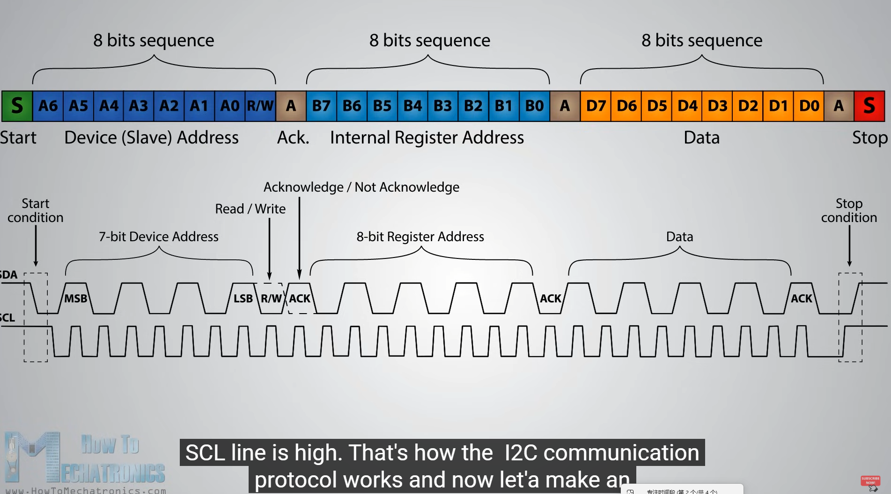

1. 总线初始化：
   总线处于空闲状态时，两个线都处于高电平

2. 发送初始信号
   由通信的主机来发送：**在SCL保持高电平的状态下，将SDA 从高电平拉低到低电平**，这个信号是用来通知总线上的所有设备，从机要开始一次新的通信

3. 发送从设备地址与读写方向
   时钟开始，在每个脉冲期间传输每一位数据
   主机会发送一个 8 位的数据，其中前 7 位是**从设备的地址**（用来确定要和哪个从设备通信），第 8 位是**读写方向位**：
      0（逻辑低）：表示对 从设备 进行 写操作；

      1（逻辑高）：表示对 从设备 进行 读操作；   

   - 总线上的所有从设备都会接收这个地址，只有地址匹配的从设备会做出应答

4. 等待从设备应答（ACK）
   地址发送完成后，**主机释放 SDA 总线**，转为输入状态
   地址匹配的从设备 ，会在 SCL 的下一个时钟周期，将 **SDA 拉低，以此作为应答信号**，告诉主机自己已经准备好
   如果主机没有收到应答，一般会停止通信 或者 重新发送起始信号

5. 数据传输阶段
   这个阶段一般根据 读写方向 的不同，产生两种情况

   - 写操作：主机依次发送 8 位的有效数据，每发送完 1 字节，都会等待从设备的应答信号，直到所有数据发送完成
   - 读操作：从设备依次发送 8 位的有效数据，每发送完 1 字节，主机就会发送应答信号，知道主机不需要再读取数据时，发送非应答信号（NACK。即 保持 SDA 为高电平）
   - 每 1 字节（8bit）的数据传输，都需要配合 8 个 SCL 时钟脉冲，数据再SCl 的高电平阶段保持稳定，在SCl  的低电平阶段进行变化

6. 发送停止信号 （Stop Condition）

7. 由主机来发送：在 SCL 保持高电平的状态下，将 SDA 从低电平拉高到高电平

8. 这个信号用来通知从设备，本次通信结束，总线会回到空闲状态

#### SDA 与 SCL

SDA和SCL都是双向线路，通过电流源或上拉电阻连接到正电源电压

当总线空闲时，两条线路都是HIGH。连接到总线的设备的输出级必须具有开漏极或开集电极来执行有线与功能。

从设备（不同的I2C地址）的SCl 、SDA、GND    对应连接 

主机的SCl 、SDA、GND 。

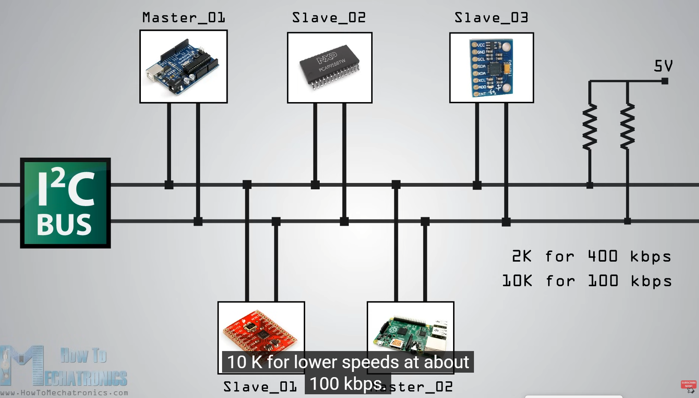

#### 数据有效性

- IIC在进行数据传输时，SCL低电平 写入，高电平 读取（**因为高电平是读，如果在高电平信号还变，那就是起始停止了**）

- 当**SCL线上的时钟信号为LOW时，数据线SDA的HIGH或LOW状态才能改变**（信号变化）。
- 当**SCL线上的时钟信号为HIGH时，数据线SDA的HIGH或LOW状态不能改变**（信号变化）。

传输的每个数据位都会产生一个时钟脉冲。

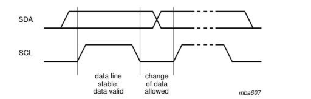

如图所示 当SCL为低电平，SDA才可转变（change of data allowed）

#### Start 和 Stop 条件

所有事务都以START(S)开始，并由STOP(P)终止(参见图5)。 SDA线上SCL为HIGH时，HIGH到LOW的转换定义了一个START条件。 SDA线上SCL为HIGH时，LOW到HIGH的转换定义了一个STOP条件。

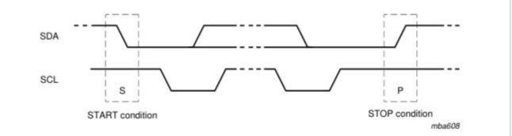

如图所示，当SCL为高电平时，SDA信号改变，就认为是开始或者结束，并且START和STOP条件总是**由主设备产生**。

#### 字节格式

每一个放在SDA线上的字节必须是8位长。每次传输可以传输的字节数是没有限制的。每一个字节后面必须跟一个确认位。数据以最有效位(MSB)为首进行传输。如果一个从机在执行其他一些功能之前不能接收或传输另一个完整的字节数据，例如**处理一个内部中断，它可以保持时钟线SCL LOW，迫使主机进入等待状态。当从机准备好接收另一个字节数据并释放时钟线SCL时，数据传输继续进行。**

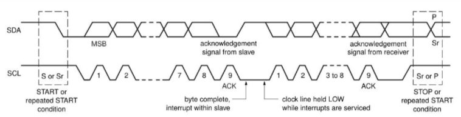

#### Acknowledge（ACK）和 Not Acknowledge（NACK）

确认信号定义如下：发送端在确认时钟脉冲期间释放SDA线，这样接收端就可以拉SDA线LOW，并且在该时钟脉冲的HIGH期间保持稳定的LOW。

当SDA在**第九个时钟**脉冲期间保持HIGH时，这被定义为不确认信号。主设备然后可以产生一个STOP条件来中止传输，或者重复的START条件来启动一个新的传输。有五个条件导致NACK的产生：

#### 时钟同步

两个主控器可以同时在一个空闲总线上开始传输，必须有一种方法来决定哪个主控器控制总线并完成传输。这是通过**时钟同步和仲裁**来实现的。在单主控器系统中，时钟同步和仲裁是不需要的。

时钟同步是通过I2C接口到SCL线的有线与连接来实现的。

这样，一个同步SCL时钟就产生了，它的低周期由低周期最长的主控机决定，而它的高周期由高周期最短的主控机决定。


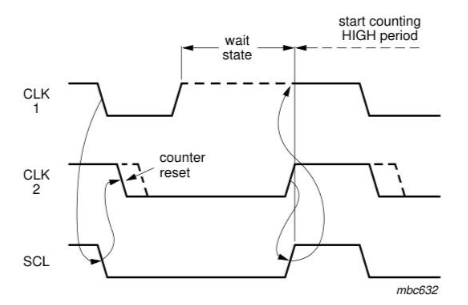

#### 仲裁

仲裁，像同步一样，是指只有在系统中使用多个主设备时才需要的协议部分。从设备不参与仲裁过程。

几个主设备在最小保持时间（tHD；STA）内在总线上产生一个START条件，然后需要仲裁来决定哪个主设备将完成它的传输。

仲裁逐位进行。在每个位期间，当SCL为HIGH时，每个主设备检查SDA电平是否与它所发送的相匹配。

第一次一个主设备试图发送HIGH，但检测到SDA电平为LOW，主设备知道它已经失去了仲裁并关闭SDA输出驱动器。另一个主设备继续完成它的事务。一个失去仲裁的主设备可以产生时钟脉冲，直到它失去仲裁的字节结束，并继续产生时钟脉冲。

**如果一个主设备也包含一个从设备功能，并且它在寻址阶段失去仲裁，有可能是获胜的主设备试图寻址它。因此，失败的主设备必须立即切换到它的从设备模式。**

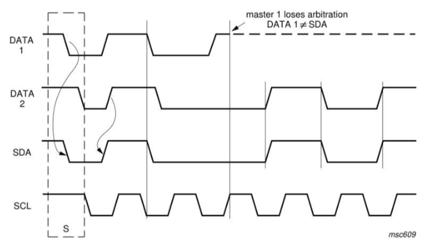

以下组合会导致一个未定义的条件：

- 主设备1发送重复的START条件，主设备2发送一个数据位。
- 主设备1发送STOP条件，主设备2发送一个数据位。
- 主设备1发送重复的START条件，主设备2发送一个STOP条件。

#### IIC传输数据的格式

##### 写操作

流程如下：

- 主芯片要发出一个start信号
- 然后发出一个设备地址(用来确定是往哪一个芯片写数据)，方向(读/写，0表示写，1表示读)
- 从设备回应(用来确定这个设备是否存在)，然后就可以传输数据
- 主设备发送一个字节数据给从设备，并等待回应
- 每传输一字节数据，接收方要有一个回应信号（确定数据是否接受完成)，然后再传输下一个数据。
- 数据发送完之后，主芯片就会发送一个停止信号。

下图：白色背景表示"主→从"，灰色背景表示"从→主"


##### 读操作

流程如下：

- 主芯片要发出一个start信号
- 然后发出一个设备地址(用来确定是往哪一个芯片写数据)，方向(读/写，0表示写，1表示读)
- 从设备回应(用来确定这个设备是否存在)，然后就可以传输数据
- 从设备发送一个字节数据给主设备，并等待回应
- 每传输一字节数据，接收方要有一个回应信号（确定数据是否接受完成)，然后再传输下一个数据。
- 数据发送完之后，主芯片就会发送一个停止信号。

下图：白色背景表示"主→从"，灰色背景表示"从→主"


##### I^2^C信号

I2C协议中数据传输的单位是字节，也就是8位。但是要用到9个时钟：前面8个时钟用来传输8数据，第9个时钟用来传输回应信号。传输时，先传输最高位(MSB)。

- 
  开始信号（S）：SCL为高电平时，SDA山高电平向低电平跳变，开始传送数据。
- 结束信号（P）：SCL为高电平时，SDA由低电平向高电平跳变，结束传送数据。
- 响应信号(ACK)：接收器在接收到8位数据后，在第9个时钟周期，拉低SDA
- SDA上传输的数据必须在SCL为高电平期间保持稳定，SDA上的数据只能在SCL为低电平期间变化


**就是在SCL为高电平时，在此状态下SDA的数据（也就是电平是有效用的，会被记录，要保持稳定）；当SCL为低电平时，在此状态可以随意切换SDA数据（电平）。**

##### 协议细节

- 如何在SDA上实现双向传输？ 主芯片通过一根SDA线既可以把数据发给从设备，也可以从SDA上读取数据，连接SDA线的引脚里面必然有两个引脚（发送引脚/接受引脚）。
- 主、从设备都可以通过SDA发送数据，肯定不能同时发送数据，怎么错开时间？ 在9个时钟里， 前8个时钟由主设备发送数据的话，第9个时钟就由从设备发送数据； 前8个时钟由从设备发送数据的话，第9个时钟就由主设备发送数据。
- 双方设备中，某个设备发送数据时，另一方怎样才能不影响SDA上的数据？ 设备的SDA中有一个三极管，使用开极/开漏电路(三极管是开极，CMOS管是开漏，作用一样)，如下图：

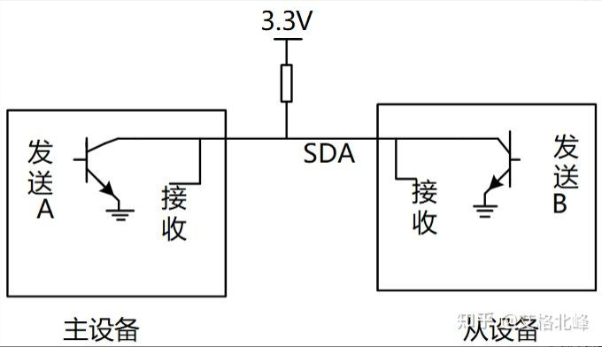

真值表如下：

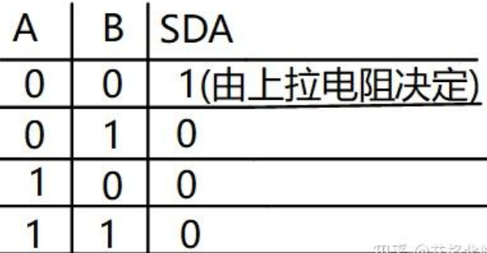

从真值表和电路图我们可以知道：

- 当某一个芯片不想影响SDA线时，那就不驱动这个三极管
- 想让SDA输出高电平，双方都不驱动三极管(SDA通过上拉电阻变为高电平)
- 想让SDA输出低电平，就驱动三极管

### SPI: The serial peripheral interface

全双工，串行、同步、主从方式工作、高速（对比UART，IIC等）；

采用TTL电平标准，传输的距离和应用场景和IIC相似

接口：至少是四线制：SDI（数据输入）、SDO（数据输出）、SCK（时钟）、CS（片选）

- MISO（主入从出）：**（Master in Slave out）（主设备输入/从设备输出引脚）。**
- MOSI（主出从入）：**（Master out Slave in）（主设备输出/从设备输入引脚）。**
- SCLK（时钟）：**（Serial Clock）串行时钟信号**，由主设备产生。
- CS（CS/SS片选）：**(Slave Select) 从设备    片选信号**，由主设备控制。它的功能是用来作为“片选引脚”，也就是**选择指定的从设备**，让主设备可以单独地与特定 从设备 通讯，避免数据线上的冲突，通常是低电平有效信号。

SPI一对一

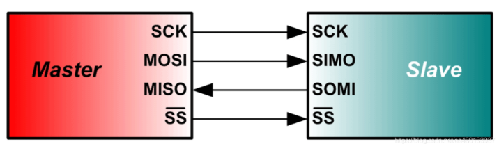

SPI一对多

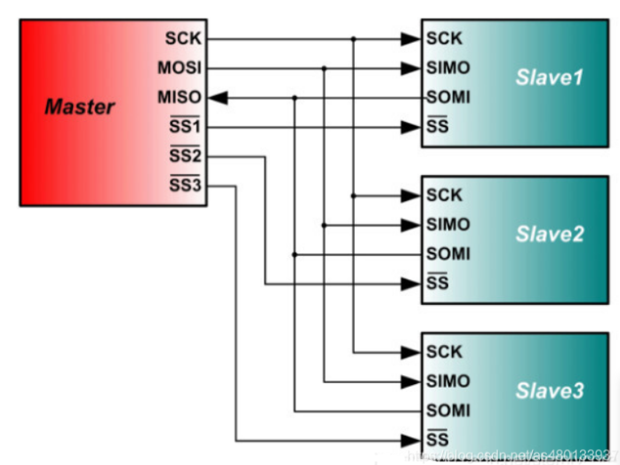

外设一多、从机一多、主机就要用多根线（多加了片选线、从机还是四根线） 可以挂载多设备、主机是总线权力者、从机只可以听取从机、被主机管理。

#### SPI设备选择

**SPI 是 【单主设备（single-master）】通信协议，这意味着总线中只有一个中心设备能发起通信。**当SPI主设备想读/写 [从设备] 时，它首先拉低 从设备 对应的 SS线 （SS线是低电平有效），接着开始发送工作脉冲到时钟线上，在相应的脉冲时间上， 主设备 把信号从MOSI实现写，同时对MISO采样而实现“读”，如下图：


先发送高位后发低位，没有IIC的应答机制

数据发送/接收：SPI只有主模式和从模式之分，当第一个时钟线上升沿或者下降沿时，发送器发送/接收数据，

外设的写操作和读操作是同步完成的，如果只进行写操作，主机只需忽略收到的字节；反之，若主机要读取从机的一个字节必须发送一个空字节来引发从机的传输。

一个时钟周期（一个上升沿一个下降沿）可以收发一位bit数据，8个时钟周期就是一个字节Byte

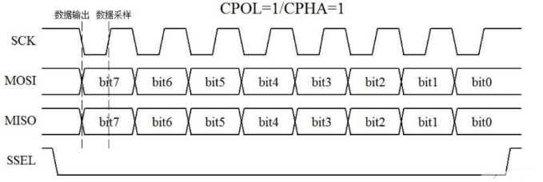

#### SPI数据发送接收

SPI主机和从机都有一个**串行移位寄存器，**主机通过向它的SPI串行寄存器写入一个字节来发起一次传输。

1. 首先**拉低对应 SS** 信号线，表示与该设备进行通信

2. 主机通过发送 **SCLK 时钟信号，来告诉从机写数据或者读数据**

   这里要注意，SCLK 时钟信号可能是低电平有效，也可能是高电平有效，因为 SPI 有四种模式，这个我们在下面会介绍

3. 主机 (Master) 将要发送的数据写到发送数据缓存区 (Memory)，缓存区经过移位寄存器 (0~7)，串行移位寄存器通过 MOSI 信号线将字节一位一位的移出去传送给从机，**同时** MISO 接口接收到的数据经过移位寄存器一位一位的移到接收缓存区。

4. 从机 (Slave) 也将自己的串行移位寄存器 (0~7) 中的内容通过 MISO 信号线返回给主机。同时通过 MOSI 信号线接收主机发送的数据，这样，**两个移位寄存器中的内容就被交换。**

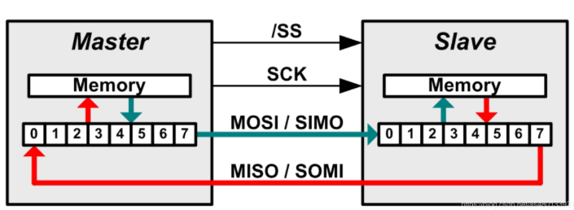

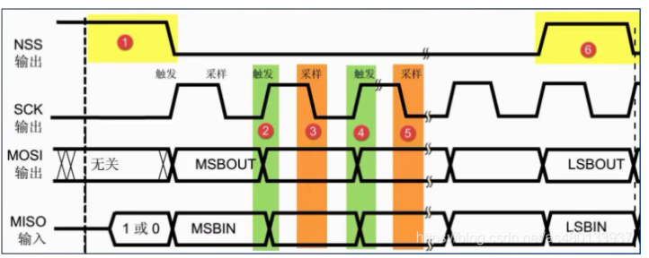

[^MSB]: 高位
[^LSB]: 低位


#### SPI通信的四种模式

```
SPI的四种模式，简单地讲就是设置SCLK时钟信号线的哪种信号是有效信号
```

SPI通信有4种不同的操作模式

- 不同的从设备可能出厂就配置成不能改变的SPI操作模式
- 通信双方必须工作在同一模式下，所以需要对主设备的SPI模式进行配置，通过CPOL（时钟极性）和CPHA（时钟相位）来控制主设备的通信模式
- 当多个不同SPI模式从设备连接同一个主设备时，**需在切换从设备前重新配置主机的 CPOL 和 CPHA 参数**，步骤如下：

1. 主机先拉低目标从设备的 SS（片选）信号线，选中该设备；
2. 同时，主机修改自身的 CPOL 和 CPHA 配置，匹配当前从设备的 SPI 模式；
3. 完成通信后，释放该从设备的 SS，切换下一个从设备时重复上述步骤（重新配置 CPOL/CPHA + 拉低对应 SS）。


[^注]: 此切换方法的前提是主设备的SPI控制器支持“动态切换CPOL/CPHA”，大部分单片机的SPI外设都具备该功能。

**CPOL 和 CPHA 的全称及含义**

**CPOL**：全称是 **Clock Polarity**（时钟极性），控制 SCLK（串行时钟）的空闲电平：

- CPOL=0，表示当 SCLK=0 时处于空闲态，所以有效状态就是 SCLK 处于高电平时
- CPOL=1，表示当 SCLK=1 时处于空闲态，所以有效状态就是 SCLK 处于低电平时

**CPHA**：全称是 **Clock Phase**（时钟相位），控制数据采样的时机：

- CPHA=0，在时钟的第一个跳变沿（上升沿或下降沿）进行数据采样。，在第 2 个边沿发送数据
- CPHA=1，在时钟的第二个跳变沿（上升沿或下降沿）进行数据采样。，在第 1 个边沿发送数据

例如:

- Mode0：CPOL=0，CPHA=0：此时空闲态时，SCLK 处于低电平，数据采样是在第 1 个边沿，也就是 SCLK 由低电平到高电平的跳变，所以数据采样是在上升沿 (准备数据)，(发送数据) 数据发送是在下降沿。
- Mode1：CPOL=0，CPHA=1：此时空闲态时，SCLK 处于低电平，数据发送是在第 1 个边沿，也就是 SCLK 由低电平到高电平的跳变，所以数据采样是在下降沿，数据发送是在上升沿。
- Mode2：CPOL=1，CPHA=0：此时空闲态时，SCLK 处于高电平，数据采集是在第 1 个边沿，也就是 SCLK 由高电平到低电平的跳变，所以数据采集是在下降沿，数据发送是在上升沿。
- Mode3：CPOL=1，CPHA=1：此时空闲态时，SCLK 处于高电平，数据发送是在第 1 个边沿，也就是 SCLK 由高电平到低电平的跳变，所以数据采集是在上升沿，数据发送是在下降沿。

| SPI 模式 | CPOL（时钟极性） | CPHA（时钟相位） | 时钟空闲电平 | 数据采样边沿           | 数据发送边沿           |
| -------- | ---------------- | ---------------- | ------------ | ---------------------- | ---------------------- |
| Mode0    | 0                | 0                | 低电平       | SCLK 上升沿（第 1 沿） | SCLK 下降沿（第 2 沿） |
| Mode1    | 0                | 1                | 低电平       | SCLK 下降沿（第 2 沿） | SCLK 上升沿（第 1 沿） |
| Mode2    | 1                | 0                | 高电平       | SCLK 下降沿（第 1 沿） | SCLK 上升沿（第 2 沿） |
| Mode3    | 1                | 1                | 高电平       | SCLK 上升沿（第 2 沿） | SCLK 下降沿（第 1 沿） |

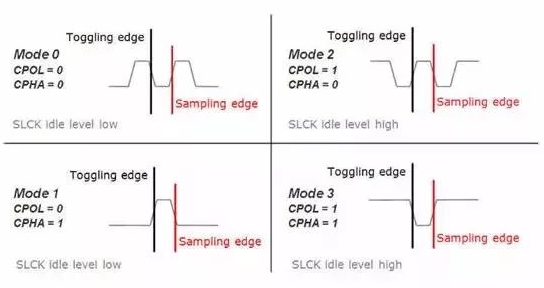

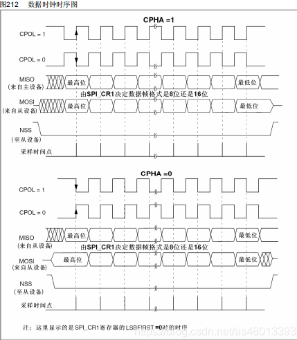

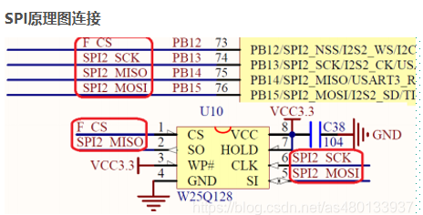

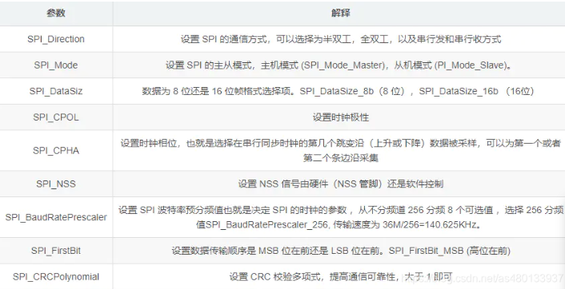

### CAN总线（Controller Area Network）

半双工，串行，**异步**、高速通信、多主机、每个设备可主动发送、具有错误检测、错误通知和错误恢复功能

核心是实现**多个设备之间的 "多主通信"**—— 总线上的任意设备都可以主动发起通信，地位平等，不需要专门的主机。

优先级仲裁：如果多个节点同时发送数据，会通过**数据帧的 ID** 来判断优先级，**ID 数值越小，优先级越高**，高优先级的节点会获得总线的使用权，避免通信冲突。

错误检测与处理：具备多种错误检测机制（**位错误、填充错误、CRC 错误等**），如果检测到错误，会**自动重发**数据；如果是严重错误，节点会自动脱离总线，避免影响其他设备

传输距离与速率：传输速率和距离负相关，最高速率**1Mbps**（传输距离<40m，最低速率**5kbps时，传输距离可达10km**）

#### 高速CAN总线

通常指的时CAN2.0B协议，支持250kbit/s至1Mbps/s之间的比特率，**闭环总线（CAN_H和CAN_L两端添加120欧的终端电阻）**；ISO11898使用的多

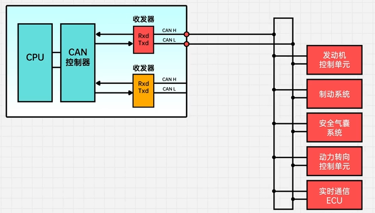

#### 低速CAN总线

主要连接车辆或工业种次要系统或附件，也称为容错CAN，支持10kbit/s至125kbit/s之间的比特率、长度可达1km、**开环总线**（CAN_H和CAN_L其中一端添加2.2K欧的终端电阻）；ISO11519

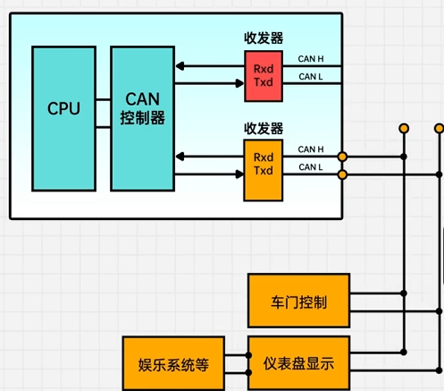

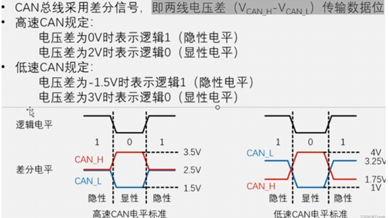

#### CAN消息帧（Controller Area Network Message Frame）

**采用差分信号（抗干扰能力强）传输数据，用CAN低线和高线表示信号的传输，无需共地**，当处于空闲状态时，CAN低和CAN高两条线上的电压保持相等

发送低电平，两根线的电压为3.5V和1.5V，逻辑值为0

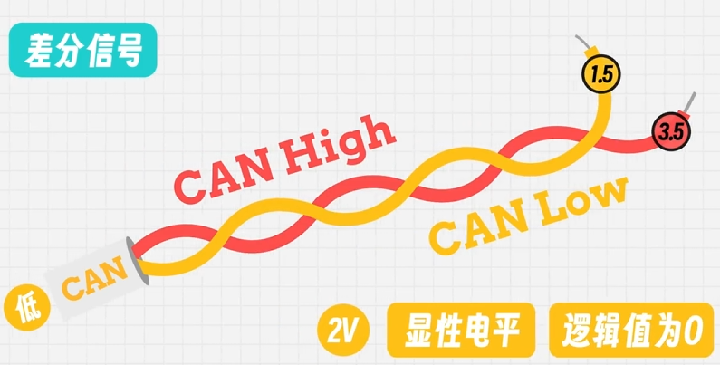

发送高电平，两根线的电压都为2.5V，逻辑值为1


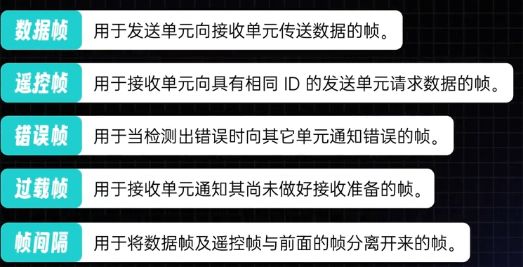

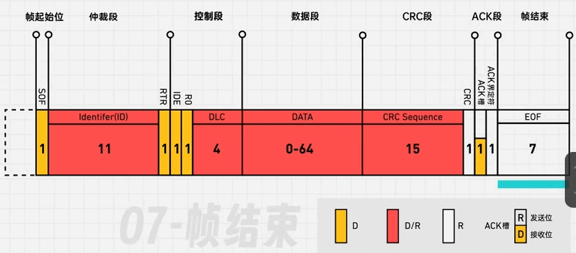

### CAN 总线数据帧各段作用说明

| 段名称              | 长度（位）   | 作用说明                                                     |
| ------------------- | ------------ | ------------------------------------------------------------ |
| **帧起始位（SOF）** | 1            | 起始信号，由发送节点发送的**低电平**，用于通知总线其他节点 “数据帧即将开始”，同步所有节点的通信时序。 |
| **仲裁段**          | 11           | 包含**标识符（ID）**，用于表示数据帧的优先级（ID 数值越小，优先级越高）；同时实现多节点发送时的总线仲裁，决定哪个节点获得总线使用权。 |
| **控制段**          | 6（1+1+1+4） | - RTR：远程传输请求位（显性0 = 数据帧，隐性1 = 遥控帧）                                          - IDE：标识符扩展位（0 = 标准 ID，1 = 扩展 ID）                                             - R0：保留位（固定为 0）                                                                                     - DLC：数据长度码，标识数据段的字节数（0~8 字节，对应 0~64 位）。 |
| **数据段**          | 0~64         | 存储实际要传输的数据，长度由 DLC 决定（最多 8 字节，即 64 位）。 |
| **CRC 段**          | 15           | 包含**CRC 序列**，是对帧起始位到数据段的内容进行循环冗余校验的结果，用于接收节点检测数据传输是否出错。 |
| **ACK 段**          | 2            | - ACK 槽：发送节点发送 “隐性电平（高）”，接收节点正确接收数据后，在此处发送 “显性电平（低）” 作为应答- ACK 界定符：固定为隐性电平，用于分隔 ACK 槽和后续段。 |
| **帧结束（EOF）**   | 7            | 由 7 个隐性电平组成，标识数据帧传                            |
