# 电阻电容电感的基础学习

## 电阻

### 电阻的常见种类

[^图片来源]: 立芯嵌入式，仅作为个人使用，无商用，引用需注明出处，如有侵权联系本人撤回

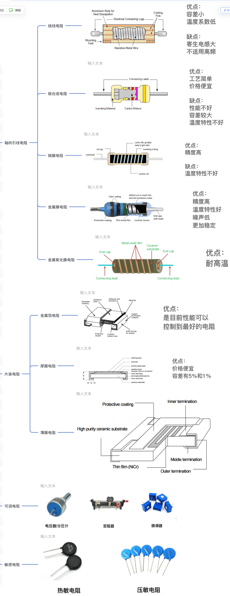

### 电阻在电路中的作用：[另类方式讲电阻！你可能理解更加深刻！](https://www.bilibili.com/video/BV1824y1F78o/?spm_id_from=333.337.search-card.all.click&vd_source=8599f11aa9cca17e6373aac78baf1844)

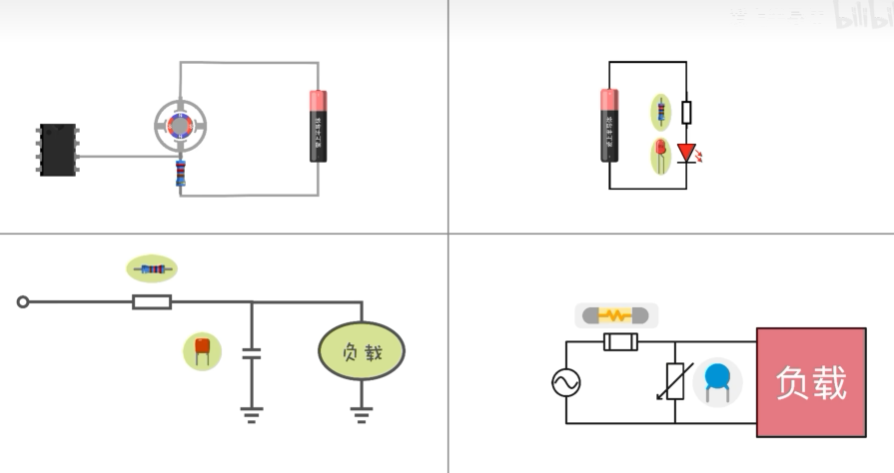

- 采样
  根据（高精度、低阻值）电阻上的电流计算压降->判断电机是否堵转/其他电路因故障导致电流增大->关闭电源、保护电路。
- 限流
  使用电阻分压，使工作器件维持在工作电压，达到限流的作用。
- 定时
  增加电阻，使电容慢慢被充满，进而负载电压缓速上升->给负载延时供电
  供电曲线图：
  
- 保护
  采用压敏电阻，当输入电压较小或正常的时候，阻值极大->电流正常通过负载；当输入电压很大的时候，阻值极小相当于短路，电流增大->熔断保险丝，保护工作器件。

**贴片电阻尺寸对照表**：

| 贴片尺寸（L） | 贴片尺寸（W） |  mm  | inch  |
| :-----------: | :-----------: | :--: | :---: |
|     0.4mm     |     0.2mm     | 0402 | 01005 |
|     0.6mm     |     0.3mm     | 0603 | 0201  |
|     1.0mm     |     0.5mm     | 1005 | 0402  |
|     1.6mm     |     0.8mm     | 1608 | 0603  |
|     2.0mm     |     1.2mm     | 2012 | 0805  |
|     3.2mm     |     1.6mm     | 3216 | 1206  |
|     3.2mm     |     2.5mm     | 3225 | 1210  |
|     5.0mm     |     2.5mm     | 5025 | 2010  |
|     6.4mm     |     3.2mm     | 6432 | 2512  |

------

## 电容

### 电容的各种作用：[另类方式讲解电容的作用，让你理解的更加深刻](https://www.bilibili.com/video/BV1UU4y1r72W/?spm_id_from=333.337.search-card.all.click&vd_source=8599f11aa9cca17e6373aac78baf1844)

- 降压

  - 电容有**容抗**表示对交流电的阻碍：

  $$
  f_c = \frac{1}{2\pi f C} 单位是\Omega
  $$

- 滤波

- 延时
  **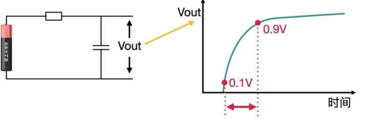**

- 耦合

  滤除了无用的直流，传递有用的交流信号：

  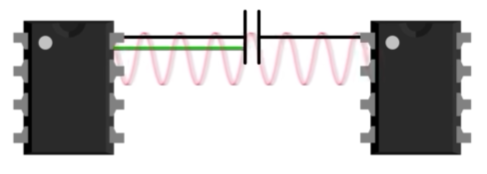

- 旁路
  滤除的是高频的交流信号（去除干扰信号，一般电容紧靠芯片，容量小的更靠近芯片）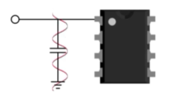

### 电容滤波原理：[深入理解滤波器！降噪的底层原理！滤波器到底是什么](https://www.bilibili.com/video/BV1ri4y1y7yG/?spm_id_from=333.337.search-card.all.click&vd_source=8599f11aa9cca17e6373aac78baf1844)？

电容有**隔直通交**的作用（频率高容易通过）：

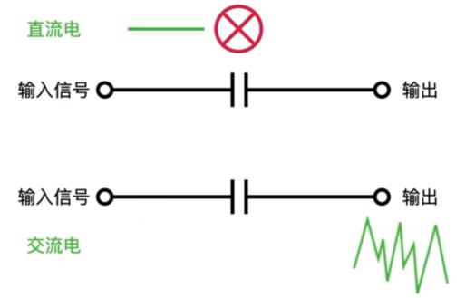

根据截止频率设置滤掉的信号的频率：
$$
RC高通滤波器的截止频率： f = \frac{1}{2\pi R C}
$$
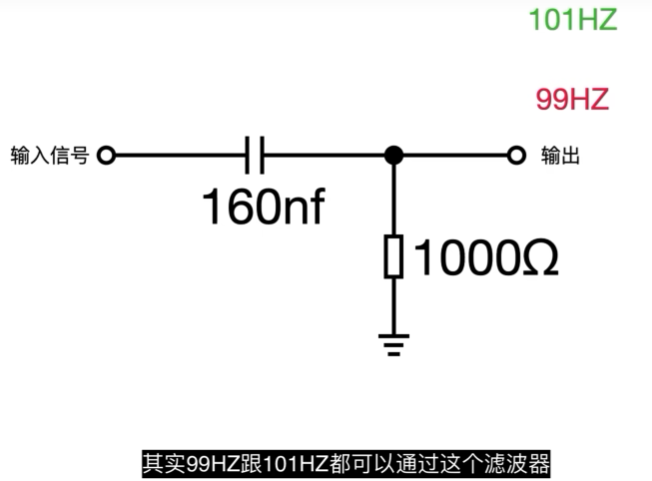但是并非截止频率一下的就完全过不去

要考虑电子学中的**增益**：

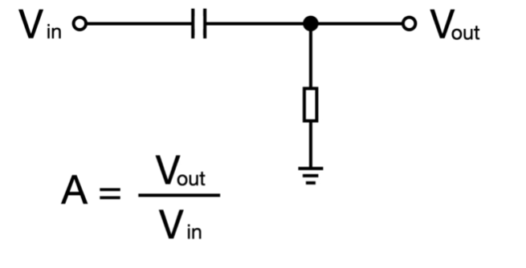

**幅频特性**，当正好处于截止频率时，输入10V的交流电，输出7V的电压；低于这个频率，信号衰减严重；高于这个频率，信号得到加强：

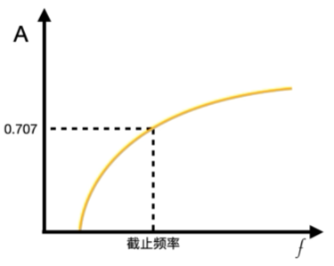

## 电感

### 电感的种类和作用：[看懂电感的这两个作用，电子学基本上就入门了](https://www.bilibili.com/video/BV1Ah4y1H7Jz/?spm_id_from=333.337.search-card.all.click&vd_source=8599f11aa9cca17e6373aac78baf1844)

- 储存能量
  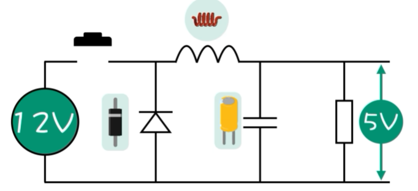

  七份时间保持断开，五份时间保持闭合：
  
  闭合开关，由于二极管的反向截止，相当于断开，电源给电感存储能量；打开开关，电感释放能量：
  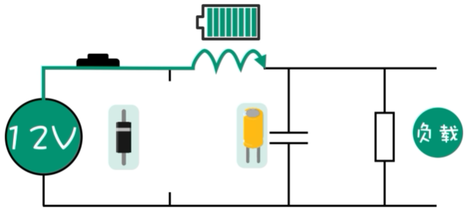
  为了让波形变平滑，增加了电容，输出符合需求的直流电：
  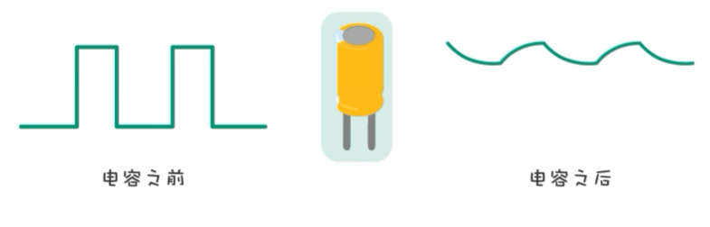
  
- 选择信号
  
  由电阻 (R)、电感 (L) 和电容 (C) 组成的电路，其中心频率（即截止频率的基准点）由谐振频率决定。

  电感和电容的组合相当于一个电阻，和上面电阻串联，构成一个分压器；下面的阻值越大，输出信号越接近输入信号。
  如果将电容换成可变电容，就是收音机的工作原理。
  
  - **谐振频率公式：**
  
      $$
      f_0 = \frac{1}{2\pi\sqrt{LC}}
      $$
  
      当处于谐振状态下，阻值最大，相当于断开，信号直接输出；其他信号则因为相当于短路顺着LC离开，完成了频率的选择：
  
      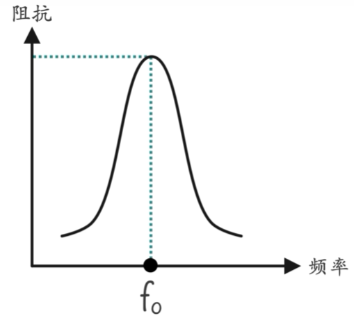
  
  - **带宽 (Bandwidth)：**
  $$
      BW = \frac{R}{2\pi L}
  $$
  
   
  
   *(带宽决定了通带的宽窄)*
  
  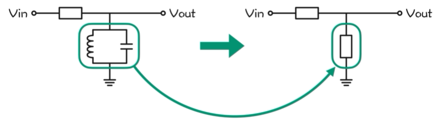
