## Chap 1

- 软件=程序+数据+文档
  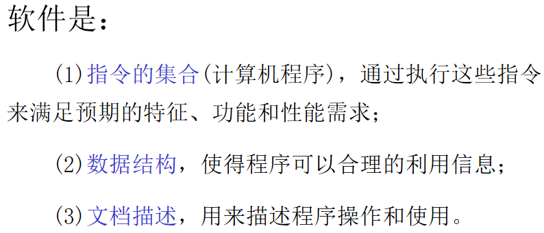

- 软件危机与软件工程的提出
  
  
  同年提出软件工程概念和思想，以克服软件危机。
  
- 软件工程的目的
  

- 面向对象方法的四个要点
  抽象、继承、封装、多态

- 生命周期模型定义与阶段划分（大阶段与小阶段），各个阶段的目的
  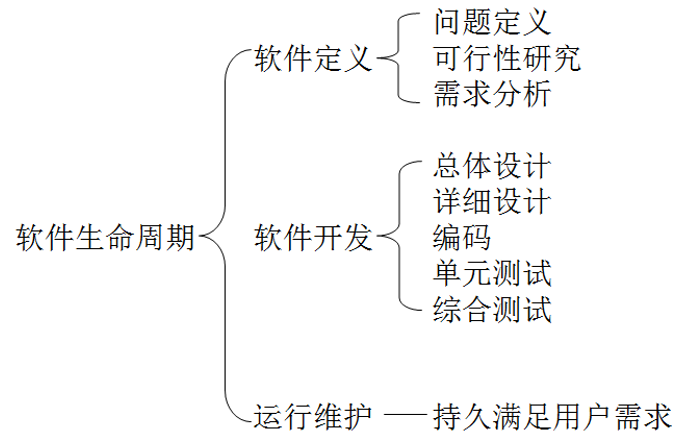

  - 阶段划分及各阶段目的

  - 大阶段划分：软件定义时期、开发时期、运行维护时期。

  - 各大连阶段细分及目的：

    1. 软件定义时期

       - 问题定义：确定软件开发工程必须完成的总目标。
       - 可行性研究：确定工程的可行性，估计完成该项工程需要的资金和成本，并制定工程进度表。
       - 需求分析：导出实现工程目标应该采用的策略及系统必须完成的功能。

       

    2. 开发时期

       - 总体设计：进行系统的总体架构设计。
       - 详细设计：对总体设计中的模块进行详细设计。
       - 编码：根据详细设计编写程序代码。
       - 单元测试：对单个模块进行测试，验证模块功能是否符合设计要求。
       - 综合测试：对整个系统进行集成和测试，确保系统整体功能正常。

       

    3. 运行维护时期：使软件持久地满足用户的需要，包括适应性调整（满足新的计算环境和技术需求）、升级（实现新的商业需求）、扩展（与更多现代系统和数据库互操作）、改建（适应多样化的网络环境）等。

- 任务软件工程方法学三要素

​	方法、工具、过程

## chap 2

- 可行性研究的任务，三个基本的可行性
  
  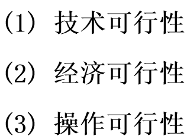
  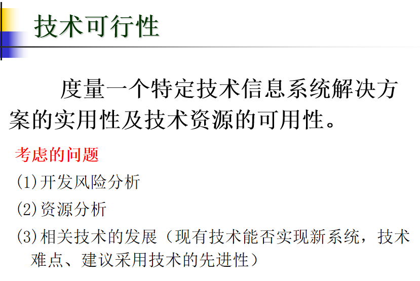
  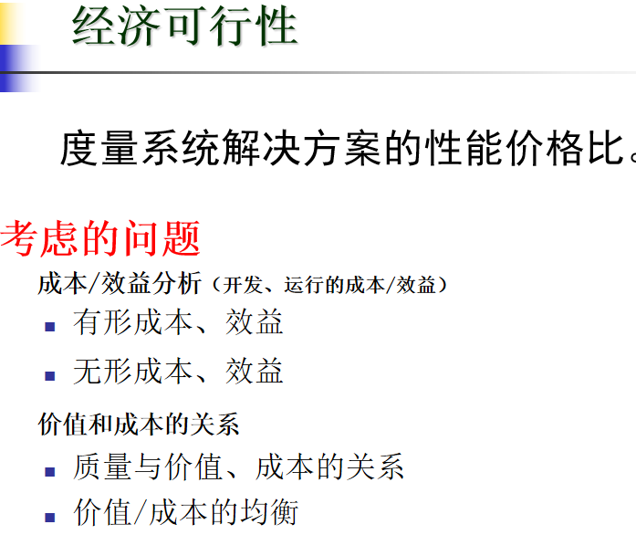
  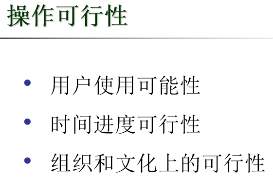
- 系统流程图
  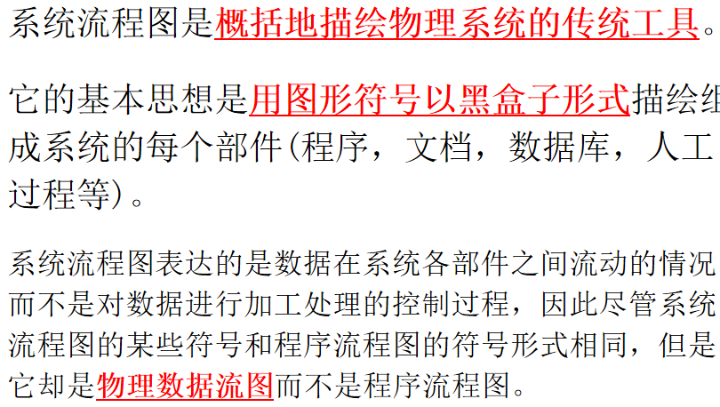
- 数据流图
  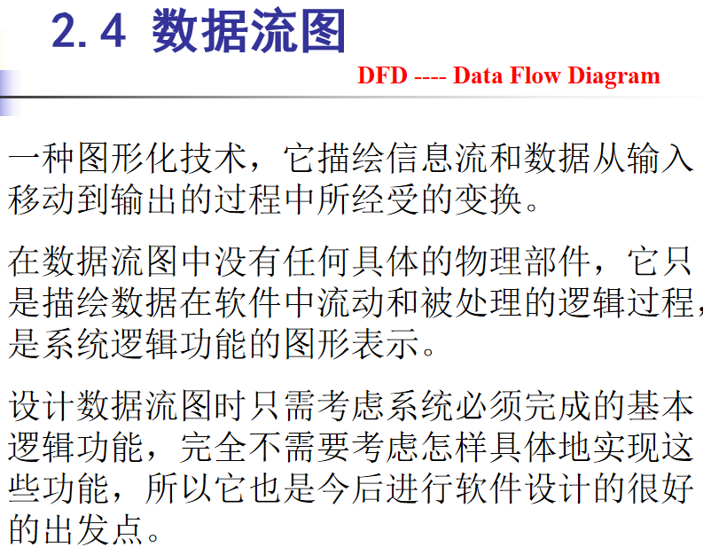
- 数据字典定义、作用与组成元素*
  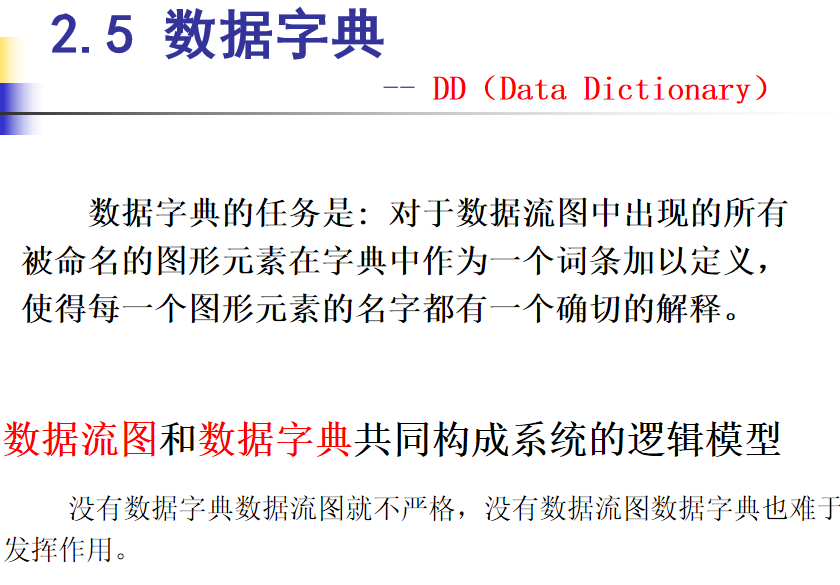
  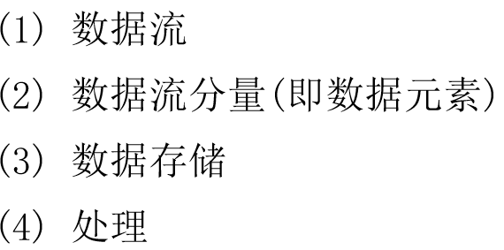

## Chap 3

- 需求分析的任务
  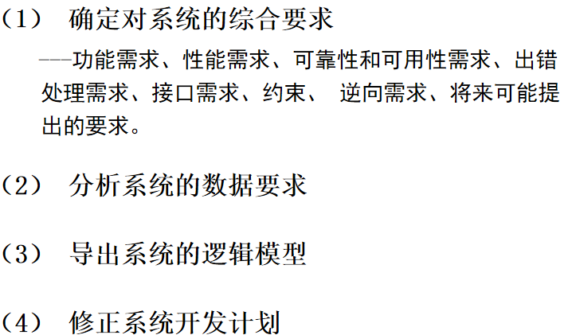

- 系统的综合需求
  功能需求、性能需求、可靠性和可用性需求、出错处理需求、接口需求、约束、逆向需求、将来可能提出的要求。

- 与用户沟通获取需求的方法*
  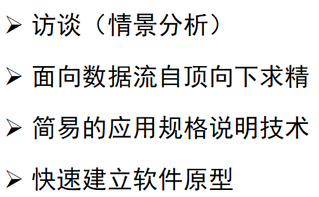
  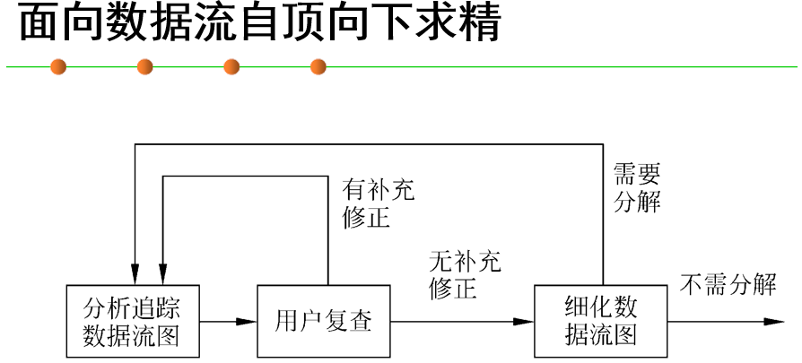
  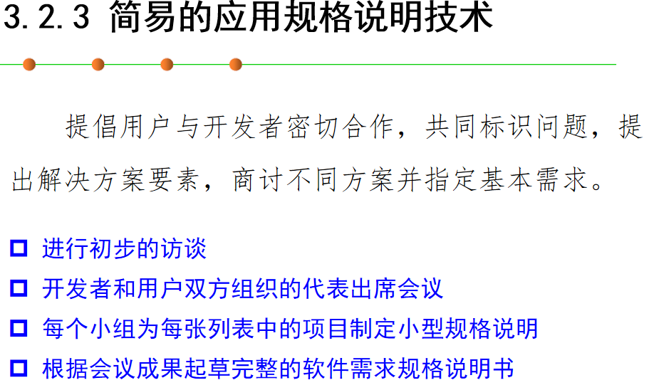

- 需求分析阶段建立的三种模型（对应三种工具）及其作用
  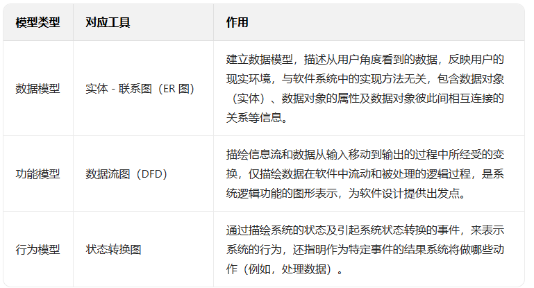
  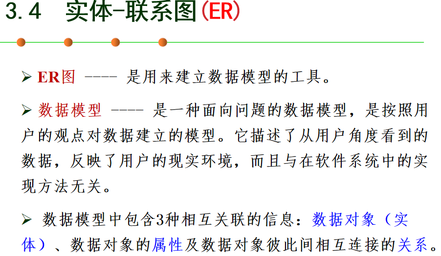

- 状态转换图、IPO图
  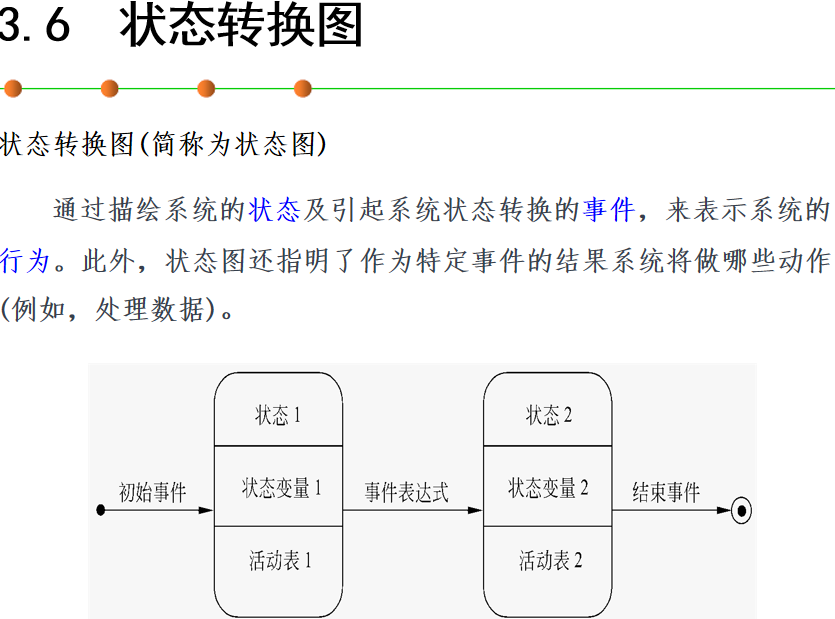
  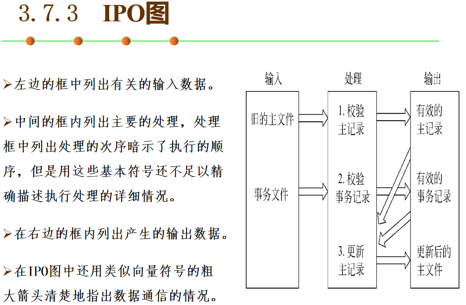

## Chap 5

- **总体设计过程包含的步骤**

1. 设想供选择的方案
2. 选择合理的方案（对每个合理方案提供系统流程图、组成系统的物理元素清单、成本 / 效益分析、实现这个系统的进度计划）
3. 推荐最佳方案
4. 功能分解
5. 设计软件结构
6. 数据库设计（模式设计、子模式设计、完整性和安全性设计、优化）
7. 制定测试计划
8. 书写文档（系统说明、用户手册、测试计划、详细的实现计划、数据库设计结果）
9. 审查和复审

- **软件设计启发式规则**
  

4. 模块的作用域应该在控制域之内
5. 力争降低模块接口的复杂度
6. 设计单入口、单出口的模块
7. 模块功能应该可以预测

- **深度、宽度、扇入、扇出**
  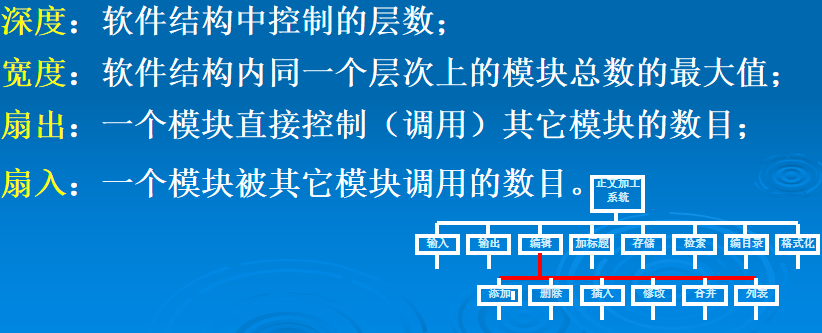
- **模块独立性：耦合与内聚概念与排序**
  
  **耦合**
  
  - 概念：指软件结构内不同模块彼此之间相互依赖（连接）的紧密程度
  
  - 排序（从低到高，推荐程度从高到低）：
  
    1. 数据耦合：两个模块之间只是通过参数交换信息，而且交换的信息仅仅是数据（最低程度的耦合）
    2. 控制耦合：两个模块之间所交换的信息包含控制信息（中等程度的耦合）
    3. 公用耦合：两个或多个模块通过一个公共区相互作用（公共区可以是全程数据区、共享通信区等）
    4. 内容耦合：一个模块与另一个模块的内容直接发生联系（最高程度的耦合，应避免）
  
    
  
  **内聚**
  
  - 概念：一个模块内部各个元素彼此结合的紧密程度，是衡量一个模块内部组成部分间整体统一性的度量
  - 排序（从高到低，推荐程度从高到低）：
    1. 功能内聚：一个模块内所有处理元素完成一个，而且仅完成一个功能（最高程度的内聚）
    2. 顺序内聚：一个模块内处理元素和同一个功能密切相关，而且这些处理元素必须顺序执行（一个处理元素的输出是另一个处理元素的输入）
    3. 通信内聚：一个模块中所有处理元素都使用同一个输入数据和（或）产生同一个输出数据（也称数据内聚）
    4. 过程内聚：一个模块内的处理元素是相关的，而且必须以特定的次序执行（控制流从一个动作流向另一个动作）
    5. 时间内聚：一个模块包含的任务必须在同一段时间内执行（也称瞬时内聚）
    6. 逻辑内聚：模块完成的任务在逻辑上属于相同或相似的一类
    7. 偶然内聚：一个模块由完成若干毫无关系的功能处理元素偶然组合在一起（最差的内聚）
  
- **数据流分析：变换型与事务型**
  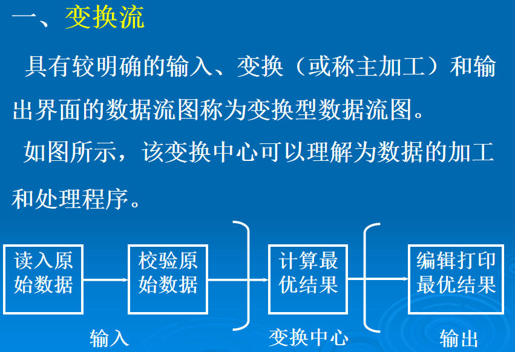
  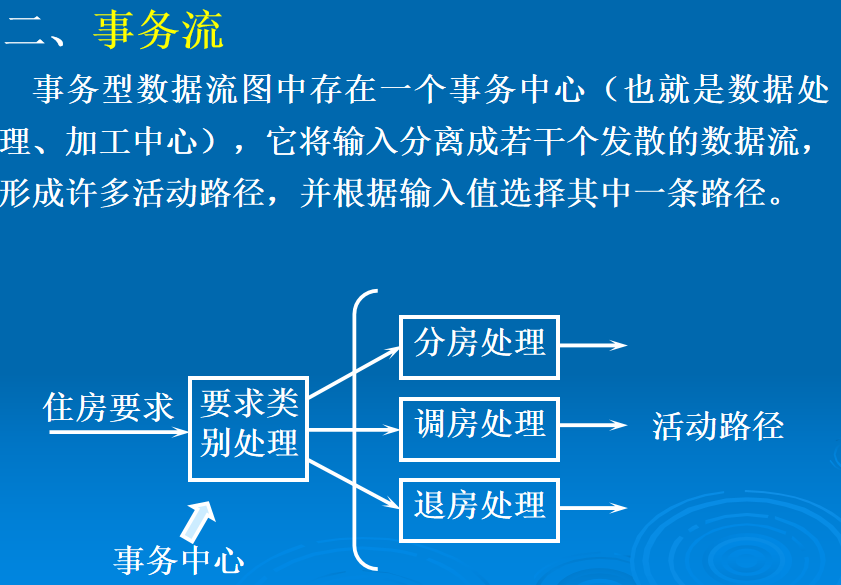
- **软件结构图**
  
- **面向数据流设计软件结构的基本步骤***
  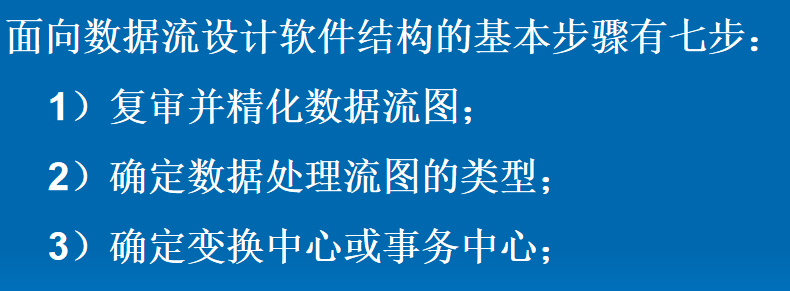
  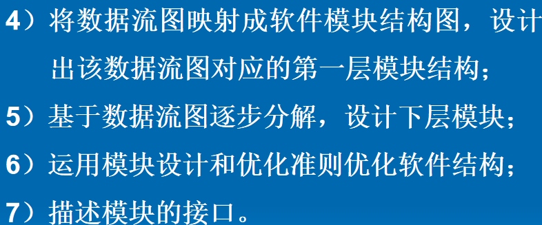

## chap 6

- **软件详细设计阶段遵循原则与结构化思想**

  **遵循原则**

  - 确定如何具体实现所要求的系统，设计程序的 “蓝图”，不具体编写程序。
  - 采用单入口单出口的控制结构。
  - 遵循自顶向下逐步求精的设计方法。
  - 保证最终程序代码的质量。

  **结构化思想**

  - 结构化程序设计是一种设计程序的技术，核心是采用自顶向下逐步求精的设计方法和单入口单出口的控制结构。
  - 理论上，仅用 “顺序”“循环” 两种基本控制结构就能构造任何单入口单出口程序，选择结构可由其构造而来。
  - 避免随意使用 Goto 语句，强调程序逻辑结构清晰，便于理解、测试、维护和重用。

- **三种基本、两种扩展以及修正的结构**

  顺序结构：相当于 “A、B”，按顺序执行两个或多个操作。

  选择结构：相当于 “If exp then A else B endif”，根据条件表达式的逻辑值选择执行不同操作。

  循环结构：相当于 “While exp do A”，当条件表达式为真时重复执行某操作。
  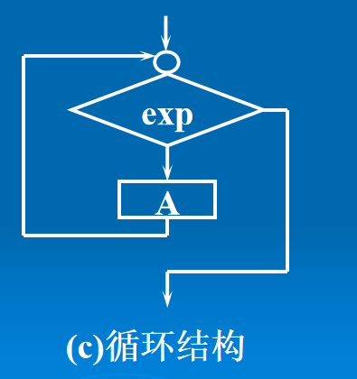
  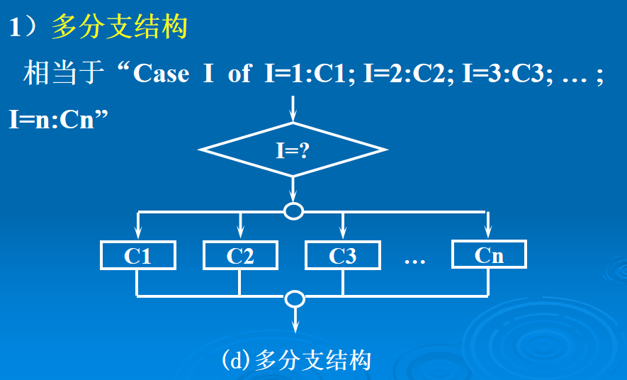
  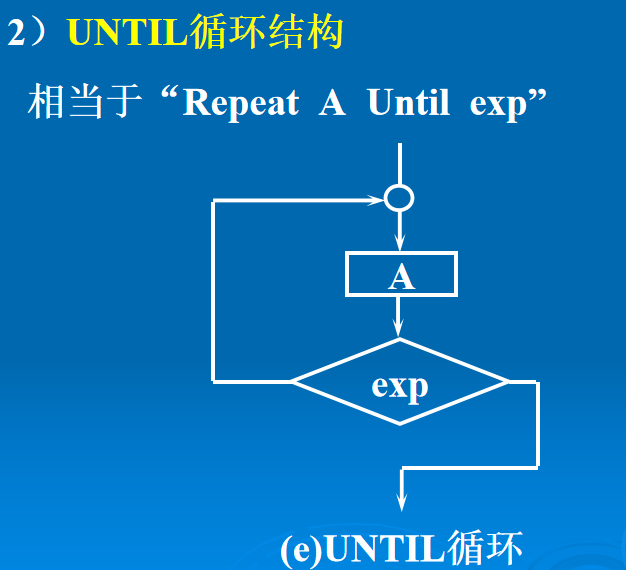
  除三种基本控制结构和两种扩充结构外，还使用 BREAK 等结构。

- **NS盒图、程序流程图,相互转换***
  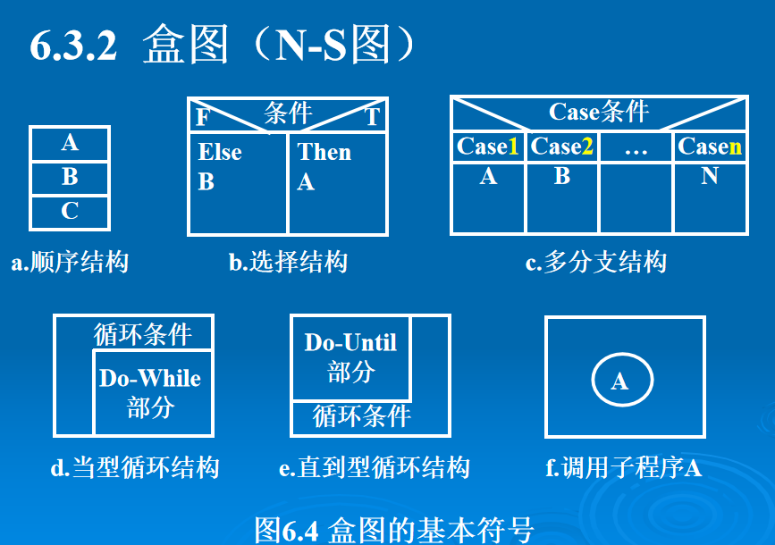

- **NS盒图的特点***
  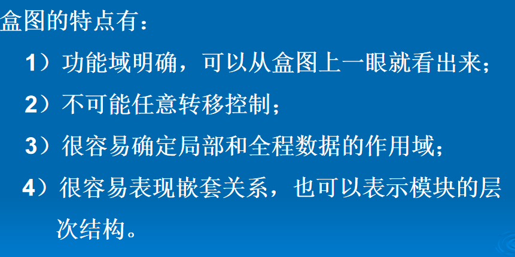

- **PAD图的优点***

  使用表示结构化控制结构的 PAD 符号所设计出来的程序必然是结构化程序。

  PAD 图所描绘的程序结构十分清晰，最左面的竖线是程序的主线（第一层结构），程序层次增加时图形向右延伸，竖线总条数即为程序层次数。

  用 PAD 图表现程序通俗易懂，程序从最左竖线上端的结点开始，自上而下、从左向右顺序执行，遍历所有结点。

  容易将 PAD 图转换成高级语言源程序，转换可由软件工具自动完成。

  可用于表示程序逻辑，也可用于描绘数据结构。

  PAD 图的符号支持自顶向下、逐步求精的方法。

- **环形复杂度的定义与三种计算方法***
  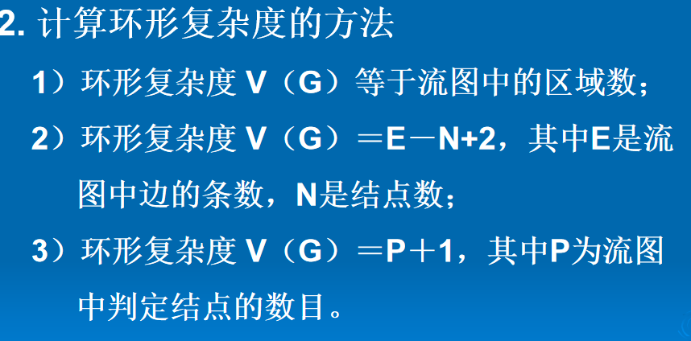

  环形复杂度是定量度量程序复杂度的指标，可反映程序控制流的复杂程度，对测试难度进行定量度量，也能对软件最终的可靠性给出某种预测。

## chap 7

- **软件测试的目的与流程**
  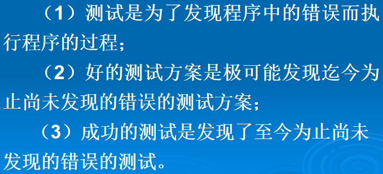

  模块测试（单元测试）：把每个模块作为单独的实体来测试。

  子系统测试：把经过单元测试的模块放在一起形成一个子系统来测试。

  系统测试：把经过测试的子系统装配成一个完整的系统来测试。

  验收测试：把软件系统作为单一的实体进行测试（利用用户的实际数据测试）。

  平行运行：同时运行新开发出来的系统和将被它取代的旧系统，以便比较新旧两个系统的处理结果

- **单元测试的测试重点***

  模块接口：对穿过模块接口的数据流进行检测，以保证正确的输入和输出。

  局部数据结构：这是错误的主要来源，设计相应的测试用例，发现数据结构方面的错误。

  重要的执行路径：由于不可能进行穷尽测试，选择关键的测试路径至关重要。

  出错处理通路：检测模块的出错处理机制是否有效。

  边界条件：测试模块在边界值情况下的运行情况，边界条件易出现错误。

- **集成测试的方法**
  
  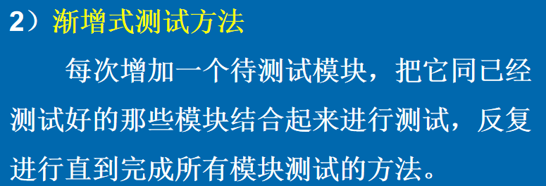
  
